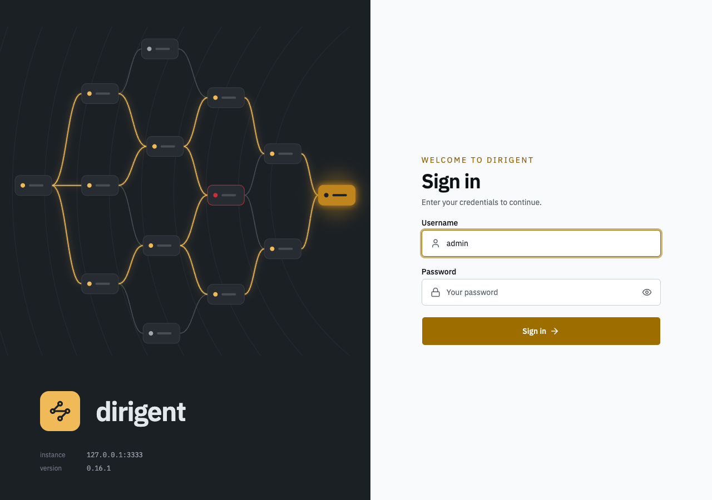
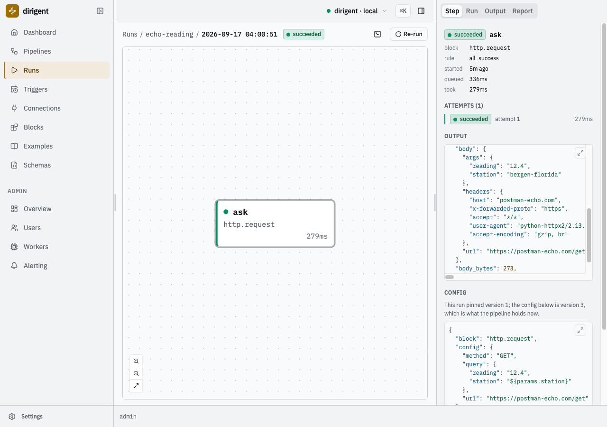
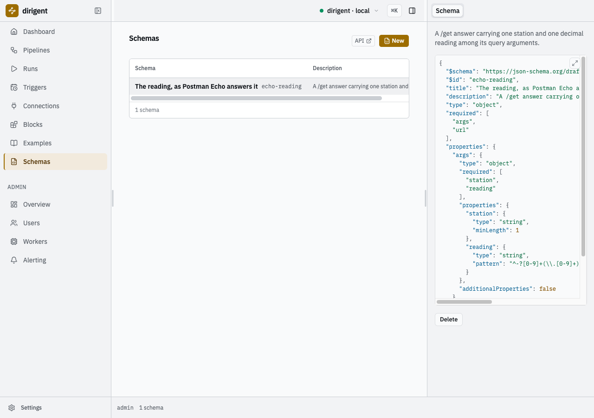
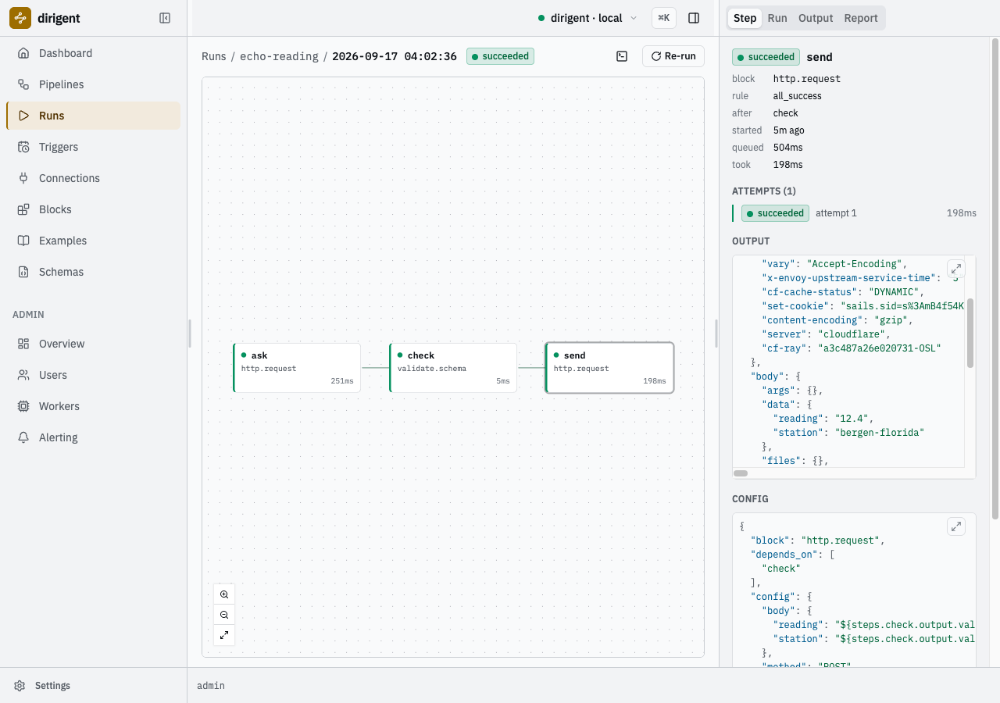
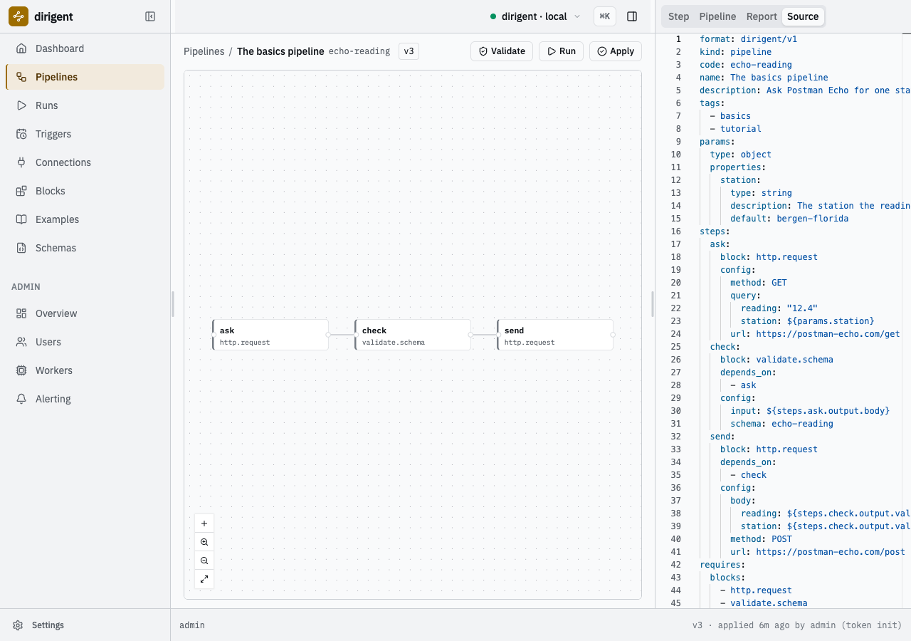
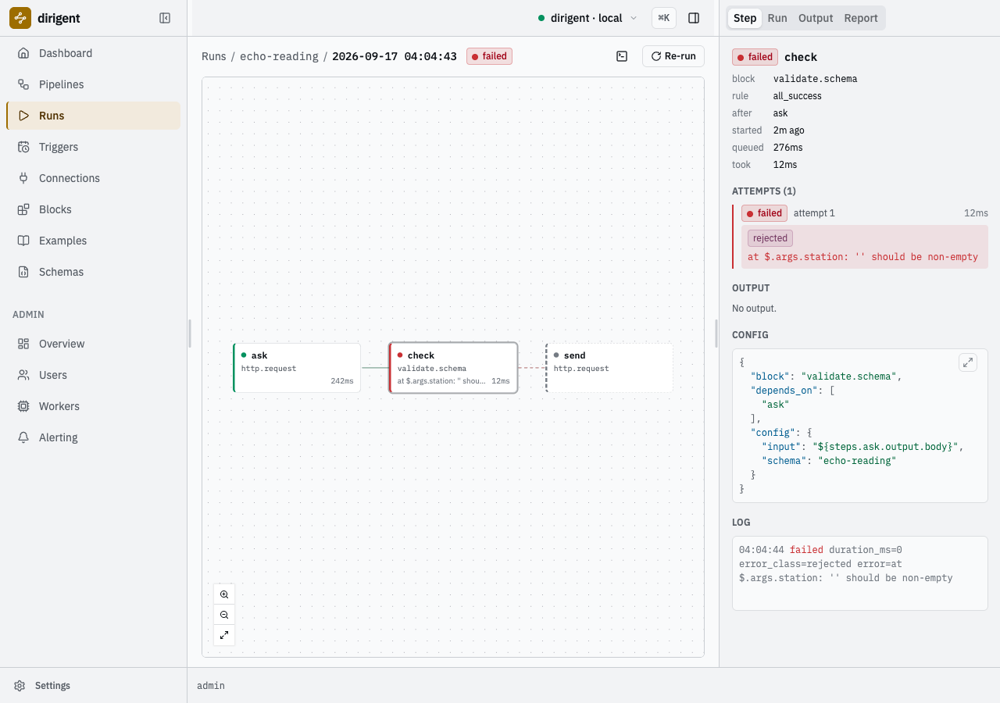
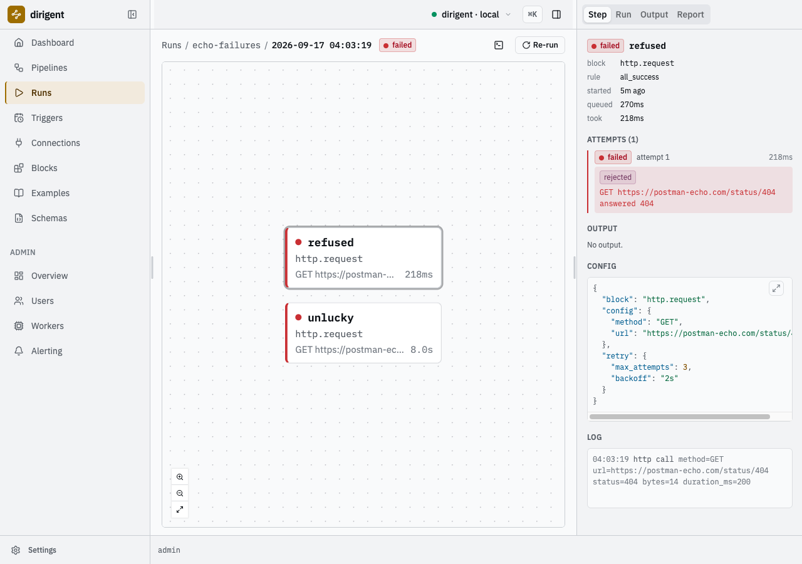
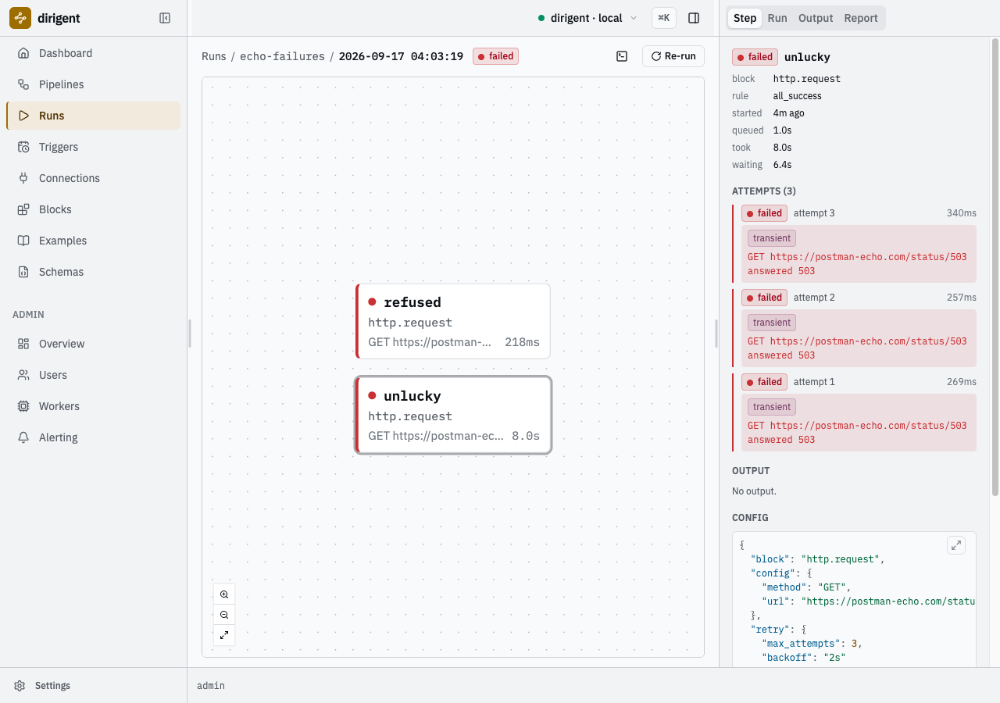
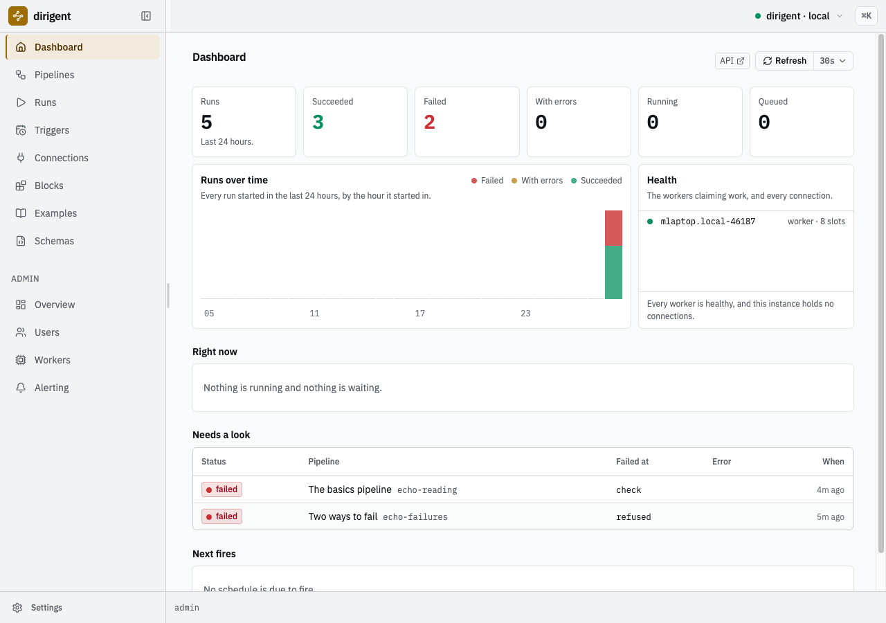

# The basics

Three moves against a service that answers anything you ask it: **one read**, **a schema gate
on the answer**, and **a send built from the validated value** -- with a deliberate failure and
a retry in between. At the end you have a project on your machine, an instance serving a UI, a
schema it holds, and a pipeline that asks, refuses an answer that has moved, and sends onward
only what passed.

!!! info "This is the first half of a two-part course"

    Nothing here assumes you have seen dirigent, or a pipeline orchestrator, before. Every step
    shows the document, the command, what the terminal printed, and what the UI shows.
    The second half,
    [**the DHIS2 tutorial**](https://winterop-com.github.io/dirigent-dhis2/tutorial/), makes
    exactly these three moves against a real DHIS2 instance, so do this one first and you will
    recognise every step of it.

    A printable copy of this page:
    [**basics.pdf**](https://winterop-com.github.io/dirigent/basics.pdf).

Everything below was run against [Postman Echo](https://postman-echo.com), a public service
that answers with the request you sent it: `/get` gives back the query arguments, `/post` gives
back the body, and `/status/<code>` answers with that status and nothing else. That makes it a
stand-in for any system you have not got yet -- you decide what the answer is, which is exactly
what you want while you are learning the shape of a pipeline rather than the shape of somebody
else's API.

What you need: Python 3.13, [uv](https://docs.astral.sh/uv/), `jq`, outbound HTTPS, and two
terminals. Every command below is run in the project directory. Nothing needs Docker,
PostgreSQL, or a credential of any kind.

## Where these documents live

Dirigent ships a corpus of documents that every instance carries and `dg examples list` reads,
and its tests hold every one of them to the catalog. This page's documents are not in it: one
of them is wrong on purpose, and a corpus that carries a broken document is a corpus you cannot
trust. So they live here, in full, and you write them into your own project as you go.

## 1. A project and an instance

`dg init` writes a uv project and the instance the project addresses -- both, in one directory:

```bash
uv tool install dirigent-cli
dg init basics --template local --password "the one you will use"
cd basics
uv sync
```

```text
2026-09-17T03:58:18.061+02:00 [info    ] initialised                    [instance.initialised] directory=/home/you/basics state=.dirigent/state schema=0001_baseline admin=admin template=local version=0.16.1
```

It creates the state directory, migrates the schema, creates the first admin, and mints that
admin one token -- shown once, and written to the project's `.env`, where the `local` profile
reads it. Nothing has to be pasted anywhere. `uv sync` then builds the project's environment
from the `pyproject.toml` it wrote, so every `uv run dg` below is the runtime this project
pins rather than whatever is on the path.

The last line it prints is the one that matters next:

```text
No DIRIGENT_SECRET_KEY is set, so a connection carrying a credential cannot be
stored until it is.
```

Nothing on this page stores a credential, so nothing here strictly needs a key. Mint one
anyway and start the instance with it, in a second terminal, in this directory -- the moment
you store your first connection the instance will want one, and an instance that changes its
key cannot read what it stored under the old one:

```bash
export DIRIGENT_SECRET_KEY="$(uv run dg secret-key)"
uv run dg dev
```

`dg secret-key` mints a key and writes it as a single plain line, terminal or pipe alike,
which is what makes that substitution work.

`dg dev` is one process holding the API, the web UI, the scheduler, one worker and a SQLite
file under `.dirigent/state/`. It keeps running; leave it. The UI is at
`http://127.0.0.1:3333`, and `admin` logs in there with the password you just gave:



*The instance serves its own UI. The pane on the left says which instance and which version.*

## 2. What a document is

A **pipeline** is a document. Not a script, not a class: a YAML file that says what should
happen and in what order, which an instance stores and a worker executes. Write this one at the
project root as `hello.yaml`:

```yaml
# The smallest document worth writing: one step makes a value, the next one reads it.

format: dirigent/v1
kind: pipeline
code: hello
name: Hello
description: One step emits a value, and the step after it writes that value into the run's log.

steps:
  # Each key under steps: is a step's name, and the name is how everything else refers to it.
  make:
    block: value.const
    config:
      value: hello from dirigent

  say:
    block: log.write
    # This edge is what makes it a pipeline rather than two commands.
    depends_on: [make]
    config:
      message: "the step before me said: ${steps.make.output.value}"
```

Five things, and they are the whole language:

- **`format`** says which document language this is, and **`kind`** which sort of document.
  Every document dirigent reads opens with those two lines.
- **`code`** is the key the pipeline is addressed by: constrained, unique on the instance, and
  what every command and every URL uses. `name` is a human title with no identity at all, and
  `description` is long-form.
- **`steps`** is a map, and each key is a **step's name**. A step names a **block** -- one unit
  of work the instance knows how to do -- and hands it a **`config`**.
- **`depends_on`** names the steps this one waits for. Those edges are the pipeline: dirigent
  works out the order from them, and runs whatever is not waiting on anything in parallel.
- **`${steps.make.output.value}`** is a **reference**: at the moment `say` is about to run, it
  is replaced by what the step named `make` actually produced. `steps.<name>.output` is that
  step's output object, and every dot after it walks into it -- an array index is a dot too,
  so `...output.value.rows.0.id` is the first row's id. `${params.<name>}` is the other one,
  and section 3 uses it.

Run it without a server at all:

```bash
uv run dg run --local hello.yaml
```

```text
2026-09-17T04:00:39.204+02:00 [info    ] started                        [run] pipeline=hello run_id=01a0ad18-3220-76eb-8df9-e50dacb275d9 local=true scratch=file:///tmp/dirigent-local-8tksuueg/artifacts/runs/01a0ad18-3220-76eb-8df9-e50dacb275d9 root=/tmp/dirigent-local-8tksuueg
2026-09-17T04:00:39.200+02:00 [info    ] queued                         [step make] block=value.const attempt=1
2026-09-17T04:00:39.244+02:00 [info    ] finished                       [log make] duration_ms=0 output_bytes=31
2026-09-17T04:00:39.239+02:00 [info    ] succeeded                      [step make] block=value.const attempt=1 duration_ms=9
2026-09-17T04:00:39.297+02:00 [info    ] the step before me said: hello from dirigent [log say]
2026-09-17T04:00:39.297+02:00 [info    ] succeeded                      [step say] block=log.write attempt=1 duration_ms=4
2026-09-17T04:00:39.394+02:00 [info    ] succeeded                      [run] pipeline=hello run_id=01a0ad18-3220-76eb-8df9-e50dacb275d9 exit_code=0
steps
┏━━━━━━┳━━━━━━━━━━━━━┳━━━━━━━━━━━┳━━━━━━━┳━━━━━━━━━━┳━━━━━━━━━━━━━━━━━━━━━━━━━━━┓
┃ step ┃ block       ┃ outcome   ┃ after ┃ duration ┃ output                    ┃
┡━━━━━━╇━━━━━━━━━━━━━╇━━━━━━━━━━━╇━━━━━━━╇━━━━━━━━━━╇━━━━━━━━━━━━━━━━━━━━━━━━━━━┩
│ make │ value.const │ succeeded │ -     │ 0.0s     │ value=hello from dirigent │
│ say  │ log.write   │ succeeded │ make  │ 0.0s     │ -                         │
└──────┴─────────────┴───────────┴───────┴──────────┴───────────────────────────┘
```

There is the reference, resolved, in the middle of the stream: `the step before me said: hello
from dirigent`. `--local` applies and runs the document in a throwaway instance in a temporary
directory and deletes it on the way out -- same apply, same engine, same worker loop, no
server. It is the fast loop, and the rest of this page leans on it.

`hello.yaml` is at the project root rather than in `pipelines/`, so the instance never sees it.
`pipelines/` is where the documents an instance should hold live, and that is where the next
one goes.

!!! tip "The terminal decides the output"

    Every command renders tables and colour when its stdout is a terminal, and writes NDJSON --
    one record per line -- when it is a pipe, a container's log or a CI job. The tables on this
    page are the rendering; `--json` asks for the records at a terminal, and `dg format` renders
    a stream that was piped or kept. Nothing is lost either way: a table is a rendering of a
    record.

## 3. The first request

The smallest useful read: ask Postman Echo for one station's reading. Write
`pipelines/echo-reading.yaml`:

```yaml
# Ask Postman Echo for one station's reading.
#
# http.request is the generic HTTP call. url: is an absolute address, which is all this needs;
# a call that repeats against one host names a connection instead.

format: dirigent/v1
kind: pipeline
code: echo-reading
name: The basics pipeline
description: Ask Postman Echo for one station's reading, and read what it answers.

tags: [basics, tutorial]

requires:
  blocks:
    - http.request

params:
  type: object
  properties:
    station:
      type: string
      default: bergen-florida
      description: The station the reading is asked for.

steps:
  ask:
    block: http.request
    config:
      url: https://postman-echo.com/get
      method: GET
      query:
        station: ${params.station}
        reading: "12.4"
```

Three things are new.

**`requires`** is the document saying what it needs of an instance -- here, one block id. An
instance missing something a document requires refuses the document rather than failing halfway
through a run.

**`params`** is a JSON Schema over the run's parameters, and `${params.station}` reads one. A
parameter with a `default` may be left out; one without must be given. `dg run ... -p
station=oslo-blindern` overrides it for one run, and a value the schema refuses stops the run
before a single call is made.

**`url`** is an absolute address, which is all a one-off call needs. The alternative is a
[**connection**](concepts.md#connection): a coded record the *instance* holds, carrying a base
URL, its credential, its TLS setting and its timeout, which the step names with `connection:`
and a `path:`. That is what you reach for the moment two steps call the same host, or the host
needs a password -- a document naming a connection code carries no secret and applies unchanged
to staging and to production. This page never needs one.

Check it offline first -- no server, no network:

```bash
uv run dg validate pipelines/echo-reading.yaml
```

```text
2026-09-17T04:00:49.109+02:00 [info    ] valid                          [validation] code=echo-reading document=pipelines/echo-reading.yaml checked="document, offline"
  each step under the last one it waits for
    ask  (http.request)
2026-09-17T04:00:49.111+02:00 [info    ] valid                          [validated] documents=1 invalid=0
```

Then store it on the instance and run it:

```bash
uv run dg apply
uv run dg run echo-reading --watch
```

```text
create echo-reading  version 1 (/home/you/basics/pipelines/echo-reading.yaml)
```

`dg apply` sends every document under `pipelines/` and stores each as an immutable version;
applying an unchanged document again is not a new version. `dg run --watch` streams the step
transitions and settles with the run:

```text
run 01a0ad18-60eb-7566-8497-7f16384117ed
pipeline      echo-reading (version 1)
status        succeeded
triggered by  admin (token init)
duration      0.3s
items         -

steps
┏━━━━━━┳━━━━━━━━━━━━━━┳━━━━━━━━━━━┳━━━━━━━┳━━━━━━━━━━┳━━━━━━━━━━┳━━━━━━━┓
┃ step ┃ block        ┃ outcome   ┃ after ┃ attempts ┃ duration ┃ error ┃
┡━━━━━━╇━━━━━━━━━━━━━━╇━━━━━━━━━━━╇━━━━━━━╇━━━━━━━━━━╇━━━━━━━━━━╇━━━━━━━┩
│ ask  │ http.request │ succeeded │ -     │ 1        │ 0.3s     │ -     │
└──────┴──────────────┴───────────┴───────┴──────────┴──────────┴───────┘

outputs
┏━━━━━━┳━━━━━━━━━━━━━━━━━━━━━━━━━━━━━━━━━━━━━━━━━━━━━━━━━━━━━━━━━━━━━━━━━━━━━━━━━━━━━━━┓
┃ step ┃ output                                                                        ┃
┡━━━━━━╇━━━━━━━━━━━━━━━━━━━━━━━━━━━━━━━━━━━━━━━━━━━━━━━━━━━━━━━━━━━━━━━━━━━━━━━━━━━━━━━┩
│ ask  │ status=200  headers={12 keys}  body={3 keys}  body_bytes=273  duration_ms=256 │
└──────┴───────────────────────────────────────────────────────────────────────────────┘
```

That is the block's whole output, summarised: `status`, `headers`, `body`, `body_bytes`,
`duration_ms`. The answer itself is in the run rather than on the screen, and because every
command writes records into a pipe, the whole of it is one `jq` away:

```bash
uv run dg runs show 01a0ad18-60eb-7566-8497-7f16384117ed --json \
  | jq '.fields.attempts[] | select(.step_name == "ask") | .output.body'
```

```json
{
  "args": {
    "reading": "12.4",
    "station": "bergen-florida"
  },
  "headers": {
    "host": "postman-echo.com",
    "x-forwarded-proto": "https",
    "accept": "*/*",
    "user-agent": "python-httpx2/2.13.0",
    "accept-encoding": "gzip, br"
  },
  "url": "https://postman-echo.com/get?reading=12.4&station=bergen-florida"
}
```

The query arguments came back under `args`, with the parameter's default in `station`. The same
run is on the Runs screen of the UI, and choosing a step opens what it produced:



*The run's only step, its one attempt, and the answer it stored.*

## 4. The gate

A read is a contract with a system you do not control. Write the contract down, and a payload
that has moved stops at the step it arrived in rather than turning into something strange three
steps later.

A **schema** is a [JSON Schema](json-schema.md) describing a payload, and
[`validate.schema`](blocks.md#validateschema) is the step that holds a value to one. A schema is
a document section, keyed by code. Add it above `steps:`, with `validate.schema` in `requires`,
and a step that names it:

```yaml
requires:
  blocks:
    - http.request
    - validate.schema

schemas:
  echo-reading:
    title: The reading, as Postman Echo answers it
    type: object
    required: [args, url]
    properties:
      args:
        type: object
        required: [station, reading]
        properties:
          station:
            type: string
            minLength: 1
          reading:
            type: string
        additionalProperties: false
      url:
        type: string

steps:
  # ... ask, unchanged ...

  check:
    block: validate.schema
    depends_on: [ask]
    config:
      input: ${steps.ask.output.body}
      schema: echo-reading
```

`type`, `required` and `properties` are the three keywords that carry most of the weight:
`required` is about presence, `properties` about shape, and `additionalProperties: false`
closes the door on anything you did not name. The rest of the language is
[JSON Schema](json-schema.md).

Now apply it:

```bash
uv run dg apply
```

```text
2026-09-17T04:01:16.458+02:00 [error   ] this document carries its own schemas (echo-reading), which an instance will not store: create them with `dg schema create` and let the document name them in requires.schemas [error] status=422 title="Unprocessable Content" instance=/api/v1/pipelines/$apply
```

That refusal is the rule worth learning early: **a server stores no schema a document carries**,
exactly as it stores no connection a document carries. A schema is a thing the instance holds
and a document names, so that two pipelines gating on the same shape are gating on the same
shape.

A carried schema is still worth having, because a local run seeds what the document brought,
and a local run is the fast loop:

```bash
uv run dg run --local pipelines/echo-reading.yaml
```

```text
steps
┏━━━━━━━┳━━━━━━━━━━━━━━━━━┳━━━━━━━━━━━┳━━━━━━━┳━━━━━━━━━━┳━━━━━━━━━━━━━━━━━━━━━━━━━━━━━━━━━━━━━━━━━┓
┃ step  ┃ block           ┃ outcome   ┃ after ┃ duration ┃ output                                  ┃
┡━━━━━━━╇━━━━━━━━━━━━━━━━━╇━━━━━━━━━━━╇━━━━━━━╇━━━━━━━━━━╇━━━━━━━━━━━━━━━━━━━━━━━━━━━━━━━━━━━━━━━━━┩
│ ask   │ http.request    │ succeeded │ -     │ 0.2s     │ status=200  headers={12 keys}  body={3  │
│       │                 │           │       │          │ keys}  body_bytes=273  duration_ms=234  │
│ check │ validate.schema │ succeeded │ ask   │ 0.0s     │ value={3 keys}                          │
└───────┴─────────────────┴───────────┴───────┴──────────┴─────────────────────────────────────────┘
```

### Break it

The gate is only worth what it catches, so catch something. Tighten one line -- `reading` is a
number, surely -- and run the same document again:

```yaml
          reading:
            type: number
```

```text
steps
┏━━━━━━━━━━━━━━━┳━━━━━━━━━━━━━━━━━┳━━━━━━━━━━━┳━━━━━━━┳━━━━━━━━━━┳━━━━━━━━━━━━━━━━━━━━━━━━━━━━━━━━━┓
┃ step          ┃ block           ┃ outcome   ┃ after ┃ duration ┃ output                          ┃
┡━━━━━━━━━━━━━━━╇━━━━━━━━━━━━━━━━━╇━━━━━━━━━━━╇━━━━━━━╇━━━━━━━━━━╇━━━━━━━━━━━━━━━━━━━━━━━━━━━━━━━━━┩
│ ask           │ http.request    │ succeeded │ -     │ 0.2s     │ status=200  headers={12 keys}   │
│               │                 │           │       │          │ body={3 keys}  body_bytes=273   │
│               │                 │           │       │          │ duration_ms=198                 │
│ check  1 warn │ validate.schema │ failed    │ ask   │ 0.0s     │ -                               │
└───────────────┴─────────────────┴───────────┴───────┴──────────┴─────────────────────────────────┘

check failed  validate.schema, attempt 1, rejected
  at $.args.reading: '12.4' is not of type 'number'
  last log lines:
    error: failed
```

Postman Echo answered 200. The read succeeded. The answer was simply not the answer this
schema was written against, and the gate says so in one line with the path in it:
`$.args.reading`, `'12.4' is not of type 'number'`.

The lesson under the lesson is worth keeping: **a query argument arrives as text**. There are
no numbers in a query string, so a reading that travelled that way is a string at the far end
however numeric it looks. The fix is not to give up on checking it -- it is to check what a
decimal written as text looks like:

```yaml
          reading:
            type: string
            pattern: "^-?[0-9]+(\\.[0-9]+)?$"
```

It passes again, and now it would catch `warm`.

### Hand the shape to the instance

Lift the schema out of the document into `schemas/echo-reading.json`. Its own keywords carry its
identity: `$id` becomes the code it is addressed by, `title` its name, `description` its body.

```json
{
  "$schema": "https://json-schema.org/draft/2020-12/schema",
  "$id": "echo-reading",
  "title": "The reading, as Postman Echo answers it",
  "description": "A /get answer carrying one station and one decimal reading among its query arguments.",
  "type": "object",
  "required": ["args", "url"],
  "properties": {
    "args": {
      "type": "object",
      "required": ["station", "reading"],
      "properties": {
        "station": { "type": "string", "minLength": 1 },
        "reading": { "type": "string", "pattern": "^-?[0-9]+(\\.[0-9]+)?$" }
      },
      "additionalProperties": false
    },
    "url": { "type": "string" }
  }
}
```

```bash
uv run dg schema create schemas/echo-reading.json
```

```text
stored schema echo-reading
```

Then delete the document's whole `schemas:` section and declare the code instead:

```yaml
requires:
  blocks:
    - http.request
    - validate.schema
  schemas:
    - echo-reading
```

The `check` step does not change: it named the schema by code all along, and the code now
resolves to the one the instance holds.

```bash
uv run dg apply
uv run dg run echo-reading --watch
```

```text
update echo-reading  version 2 (/home/you/basics/pipelines/echo-reading.yaml)
  steps added: check
```

```text
steps
┏━━━━━━━┳━━━━━━━━━━━━━━━━━┳━━━━━━━━━━━┳━━━━━━━┳━━━━━━━━━━┳━━━━━━━━━━┳━━━━━━━┓
┃ step  ┃ block           ┃ outcome   ┃ after ┃ attempts ┃ duration ┃ error ┃
┡━━━━━━━╇━━━━━━━━━━━━━━━━━╇━━━━━━━━━━━╇━━━━━━━╇━━━━━━━━━━╇━━━━━━━━━━╇━━━━━━━┩
│ ask   │ http.request    │ succeeded │ -     │ 1        │ 0.3s     │ -     │
│ check │ validate.schema │ succeeded │ ask   │ 1        │ 0.0s     │ -     │
└───────┴─────────────────┴───────────┴───────┴──────────┴──────────┴───────┘
```



*The shape the instance now holds. Any pipeline on this instance may gate on it by code.*

## 5. The send

Now send something on -- built from the value the gate passed.

`validate.schema` hands its input on unchanged as `value`, which makes the gate a **waypoint**:
every step past it provably received the shape. So the send does not read the request's answer
again, it reads the gate's output:

```yaml
  send:
    block: http.request
    depends_on: [check]
    config:
      url: https://postman-echo.com/post
      method: POST
      # Read out of the gate rather than out of the read: every step past a gate provably
      # received the shape the gate passed.
      body:
        station: ${steps.check.output.value.args.station}
        reading: ${steps.check.output.value.args.reading}
```

```bash
uv run dg apply
uv run dg run echo-reading --watch
```

```text
update echo-reading  version 3 (/home/you/basics/pipelines/echo-reading.yaml)
  steps added: send
```

```text
steps
┏━━━━━━━┳━━━━━━━━━━━━━━━━━┳━━━━━━━━━━━┳━━━━━━━┳━━━━━━━━━━┳━━━━━━━━━━┳━━━━━━━┓
┃ step  ┃ block           ┃ outcome   ┃ after ┃ attempts ┃ duration ┃ error ┃
┡━━━━━━━╇━━━━━━━━━━━━━━━━━╇━━━━━━━━━━━╇━━━━━━━╇━━━━━━━━━━╇━━━━━━━━━━╇━━━━━━━┩
│ ask   │ http.request    │ succeeded │ -     │ 1        │ 0.2s     │ -     │
│ check │ validate.schema │ succeeded │ ask   │ 1        │ 0.0s     │ -     │
│ send  │ http.request    │ succeeded │ check │ 1        │ 0.2s     │ -     │
└───────┴─────────────────┴───────────┴───────┴──────────┴──────────┴───────┘

outputs
┏━━━━━━━┳━━━━━━━━━━━━━━━━━━━━━━━━━━━━━━━━━━━━━━━━━━━━━━━━━━━━━━━━━━━━━━━━━━━━━━━━━━━━━━━┓
┃ step  ┃ output                                                                        ┃
┡━━━━━━━╇━━━━━━━━━━━━━━━━━━━━━━━━━━━━━━━━━━━━━━━━━━━━━━━━━━━━━━━━━━━━━━━━━━━━━━━━━━━━━━━┩
│ ask   │ status=200  headers={12 keys}  body={3 keys}  body_bytes=273  duration_ms=232 │
│ check │ value={3 keys}                                                                │
│ send  │ status=200  headers={12 keys}  body={7 keys}  body_bytes=378  duration_ms=184 │
└───────┴───────────────────────────────────────────────────────────────────────────────┘
```

Postman Echo answers a POST with the body it was given, so its answer is the proof of what was
sent:

```bash
uv run dg runs show 01a0ad19-fb7b-7449-94b4-c4fa802d7715 --json \
  | jq '.fields.attempts[] | select(.step_name == "send") | .output.body.json'
```

```json
{
  "reading": "12.4",
  "station": "bergen-florida"
}
```

The station and the reading made it from the first step's answer, through the gate, into the
second step's request -- and neither value was written twice in the document.



*The gate's output, referenced by the step after it, and the answer that came back.*

The pipeline is three steps now, and the builder draws what the document said:



*`ask` to `check` to `send`. The edges are the `depends_on` lines, and the Source tab is the document the instance holds.*

## 6. When it goes wrong

Three failures, and the difference between them is the whole of what a retry policy is for.

### A gate refuses what it was given

The schema is right; give it something that is not the shape. `-p` sets a parameter for one
run, and an empty station is a string the schema will not have:

```bash
uv run dg run echo-reading --watch -p station=
```

```text
steps
┏━━━━━━━━━━━━━━━┳━━━━━━━━━━━━━━━━━┳━━━━━━━━━━━┳━━━━━━━┳━━━━━━━━━━┳━━━━━━━━━━┳━━━━━━━━━━━━━━━━━━━━━━┓
┃ step          ┃ block           ┃ outcome   ┃ after ┃ attempts ┃ duration ┃ error                ┃
┡━━━━━━━━━━━━━━━╇━━━━━━━━━━━━━━━━━╇━━━━━━━━━━━╇━━━━━━━╇━━━━━━━━━━╇━━━━━━━━━━╇━━━━━━━━━━━━━━━━━━━━━━┩
│ ask           │ http.request    │ succeeded │ -     │ 1        │ 0.2s     │ -                    │
│ check  1 warn │ validate.schema │ failed    │ ask   │ 1        │ 0.0s     │ at $.args.station:   │
│               │                 │           │       │          │          │ '' should be         │
│               │                 │           │       │          │          │ non-empty            │
│ send          │ http.request    │ skipped   │ check │ 1        │ -        │ -                    │
└───────────────┴─────────────────┴───────────┴───────┴──────────┴──────────┴──────────────────────┘

check failed  validate.schema, attempt 1, rejected
  at $.args.station: '' should be non-empty
  last log lines:
    error: failed
```

`send` is **skipped**, not failed: it never ran, because the step it waits for did not succeed.
That is the point of a gate -- nothing downstream of it ever sees a value it refused.



*A rejected gate, its one attempt, the message with the path in it, and the step that never ran.*

### A refusal is not retried, an outage is

Note the class on that failure: **rejected**. It decides whether a retry is even attempted, and
the clearest way to see it is two steps that fail differently under the same budget. Write
`pipelines/echo-failures.yaml`:

```yaml
# Two failures with the same retry budget, to show what the budget is actually for.
#
# Neither step depends on the other, so both run in the same run and the run's table puts
# them side by side.

format: dirigent/v1
kind: pipeline
code: echo-failures
name: Two ways to fail
description: One step is refused and one is unlucky, and only one of them is retried.

tags: [basics, tutorial]

requires:
  blocks:
    - http.request

steps:
  refused:
    block: http.request
    retry:
      max_attempts: 3
      backoff: 2s
    config:
      # 404 is the service saying the thing is not there. Asking again cannot change that.
      url: https://postman-echo.com/status/404
      method: GET

  unlucky:
    block: http.request
    retry:
      max_attempts: 3
      backoff: 2s
    config:
      # 503 is the service saying it is unwell right now, which is a different sentence.
      url: https://postman-echo.com/status/503
      method: GET
```

```bash
uv run dg run --local pipelines/echo-failures.yaml
```

```text
steps
┏━━━━━━━━━┳━━━━━━━━━━━━━━┳━━━━━━━━━┳━━━━━━━┳━━━━━━━━━━┳━━━━━━━━┓
┃ step    ┃ block        ┃ outcome ┃ after ┃ duration ┃ output ┃
┡━━━━━━━━━╇━━━━━━━━━━━━━━╇━━━━━━━━━╇━━━━━━━╇━━━━━━━━━━╇━━━━━━━━┩
│ refused │ http.request │ failed  │ -     │ 0.2s     │ -      │
│ unlucky │ http.request │ failed  │ -     │ 0.2s     │ -      │
│ unlucky │ http.request │ failed  │ -     │ 0.2s     │ -      │
│ unlucky │ http.request │ failed  │ -     │ 0.3s     │ -      │
└─────────┴──────────────┴─────────┴───────┴──────────┴────────┘

refused failed  http.request, attempt 1, rejected
  GET https://postman-echo.com/status/404 answered 404
  last log lines:
    info: http call

unlucky failed  http.request, attempt 1, transient
  GET https://postman-echo.com/status/503 answered 503
  last log lines:
    info: http call

unlucky failed  http.request, attempt 2, transient
  GET https://postman-echo.com/status/503 answered 503
  last log lines:
    info: http call

unlucky failed  http.request, attempt 3, transient
  GET https://postman-echo.com/status/503 answered 503
  last log lines:
    info: http call
```

Same budget, one row against three. A **rejected** failure spends no budget, because the
service will answer the same way in two seconds and in two hours; a **transient** one spends
all of it. The delay between attempts is data rather than a sleep: each failure writes the next
attempt's time into the future and the worker moves on, so nothing holds a worker slot for the
backoff.

Apply it and run it on the instance too, because the contrast is worth seeing on a screen:

```bash
uv run dg apply
uv run dg run echo-failures --watch
```



*One attempt, with three allowed. A rejected failure never touches the budget.*



*The same budget, spent. Every attempt is a row of its own, with its own resolved config and its own logs, which is what makes a retry auditable rather than a counter.*

That classification is a block's job, and every block makes it the same way:

| What happened | Class | Retried |
| --- | --- | --- |
| A connection or read failure on the wire | `transient` | yes |
| The service answered 5xx | `transient` | yes |
| The service answered 429, rate limiting | `transient` | yes |
| The service answered any other 4xx | `rejected` | no |
| A gate refused the value | `rejected` | no |
| A config or reference that will not resolve | `rejected` | no |

429 is the one client error worth retrying: the service is asking you to come back, and the
same call succeeds once the window has passed. That is why `max_attempts` above 1 is worth
writing on a step that calls anything over a network at all -- and why it costs nothing on the
step that was simply wrong.

## 7. What you have

An instance on your machine, a schema it holds, a pipeline in three versions, a second pipeline
that fails on purpose, and the runs behind them:



*The instance after this page: the runs, and the two failures that are still worth looking at.*

You have also met, by doing rather than by reading, most of what dirigent is: a document, a
step, a block, a reference, a parameter, a schema, a version, a run, an attempt, and an error
class. [**Concepts**](concepts.md) is that vocabulary written down properly, and it is the
right next page to read.

### Where to go next

- [**The DHIS2 tutorial**](https://winterop-com.github.io/dirigent-dhis2/tutorial/) is the
  other half of this course: the same three moves -- read, gate, send -- against a real DHIS2
  instance, with a pack's blocks instead of raw HTTP.
- [**The tutorial**](tutorial.md) builds one realistic pipeline instead of a small one: a
  sensor that holds a run until a window opens, a fan-out over a list, an error branch, a
  schedule and an alert rule -- and a real mistake in the middle.
- **`dg examples`** is the corpus this instance ships, and the ones tagged `starter` are
  written to be copied:

```bash
uv run dg examples list --starter --shelf recipes
```

```text
examples
┏━━━━━━━━━━━━━━━━━━━┳━━━━━━━━━━━━━━━━━━┳━━━━━━━━━━━━━━━━━━━┳━━━━━━━━━━┳━━━━━━━━━┳━━━━━━━━━━━━━━━━━━┓
┃ code              ┃ name             ┃ tags              ┃ plugin   ┃ starter ┃ needs            ┃
┡━━━━━━━━━━━━━━━━━━━╇━━━━━━━━━━━━━━━━━━╇━━━━━━━━━━━━━━━━━━━╇━━━━━━━━━━╇━━━━━━━━━╇━━━━━━━━━━━━━━━━━━┩
│ http-fetch-valid… │ Fetch, validate, │ recipes http      │ examples │ *       │ 2 schemas, 3     │
│                   │ transform,       │ transform         │          │         │ blocks           │
│                   │ validate, post   │ validate          │          │         │                  │
│ http-post-report  │ POST a batch and │ recipes http      │ examples │ *       │ 2 blocks         │
│                   │ report on it     │ transform report  │          │         │                  │
│ http-save-body-t… │ A response body  │ recipes http      │ examples │ *       │ 4 blocks         │
│                   │ saved to storage │ storage transform │          │         │                  │
│ json-to-csv-flat… │ Nested JSON to a │ recipes storage   │ examples │ *       │ 5 blocks         │
│                   │ flat csv         │ transform         │          │         │                  │
│ ndjson-to-parquet │ Records to       │ recipes storage   │ examples │ *       │ 6 blocks         │
│                   │ parquet and back │ transform parquet │          │         │                  │
│ report-built-in   │ The built-in     │ recipes transform │ examples │ *       │ 2 blocks         │
│                   │ report           │ report            │          │         │                  │
│ report-to-file    │ Render a report  │ recipes report    │ examples │ *       │ 6 blocks         │
│                   │ and write it to  │ storage transform │          │         │                  │
│                   │ a file           │                   │          │         │                  │
│ storage-write-th… │ Write to         │ recipes storage   │ examples │ *       │ 3 blocks         │
│                   │ storage, then    │ transform         │          │         │                  │
│                   │ read it back     │                   │          │         │                  │
└───────────────────┴──────────────────┴───────────────────┴──────────┴─────────┴──────────────────┘
```

```bash
uv run dg pipeline new http-fetch-validate-transform-validate-post
```

It copies the document into `pipelines/` verbatim -- comments and all -- rewriting only the
`code:` line, and then says what the instance still has to hold before it will apply. The
Examples screen in the UI is the same catalogue, and it says per document what this instance is
missing.

- [**The block reference**](blocks.md) is every block's config and output, exactly as the
  catalog publishes them.
- [**The command line**](cli.md) is profiles, projects, parameters and the whole command tree.
- [**Getting started**](getting-started.md) is the other shapes an instance comes in, including
  the three-service production stack.

## The documents in full

`pipelines/echo-reading.yaml`:

```yaml
# Ask Postman Echo for one station's reading, hold the answer to a shape, and send the
# validated values back to it.

format: dirigent/v1
kind: pipeline
code: echo-reading
name: The basics pipeline
description: Ask Postman Echo for one station's reading, and hold the answer to a shape.

tags: [basics, tutorial]

requires:
  blocks:
    - http.request
    - validate.schema
  schemas:
    - echo-reading

params:
  type: object
  properties:
    station:
      type: string
      default: bergen-florida
      description: The station the reading is asked for.

steps:
  ask:
    block: http.request
    config:
      url: https://postman-echo.com/get
      method: GET
      query:
        station: ${params.station}
        reading: "12.4"

  check:
    block: validate.schema
    depends_on: [ask]
    config:
      input: ${steps.ask.output.body}
      schema: echo-reading

  send:
    block: http.request
    depends_on: [check]
    config:
      url: https://postman-echo.com/post
      method: POST
      # Read out of the gate rather than out of the read: every step past a gate provably
      # received the shape the gate passed.
      body:
        station: ${steps.check.output.value.args.station}
        reading: ${steps.check.output.value.args.reading}
```

`schemas/echo-reading.json` is the file `dg schema create` stored, printed in section 4, and
`pipelines/echo-failures.yaml` is printed in section 6 in full.

When you are done, the instance is a directory: stop `dg dev` and delete `basics/`, and nothing
of it is left behind.
