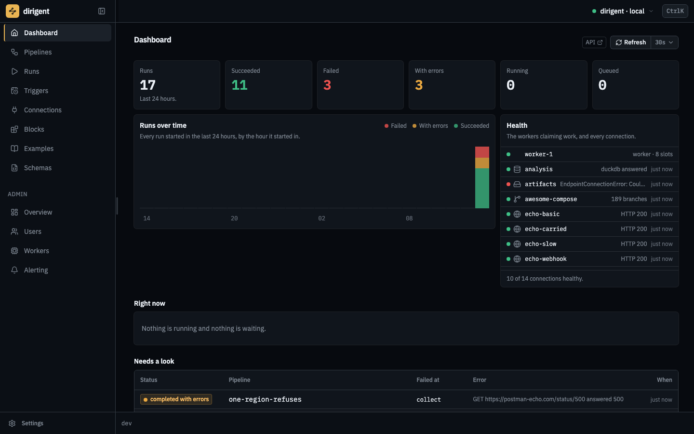
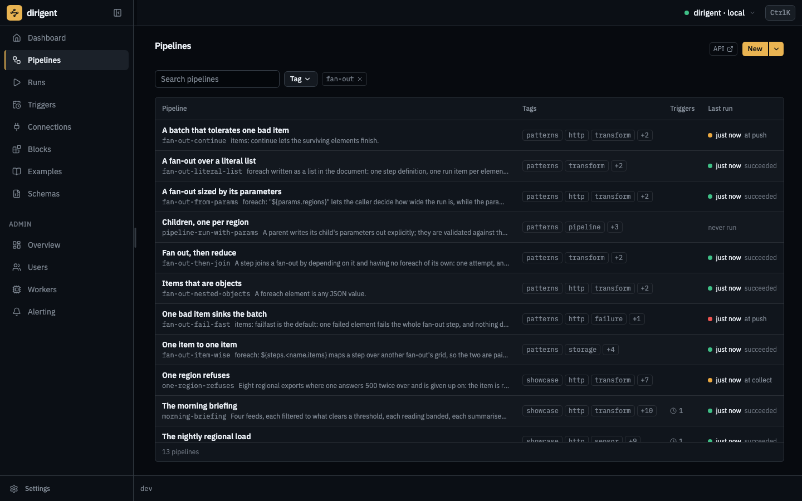
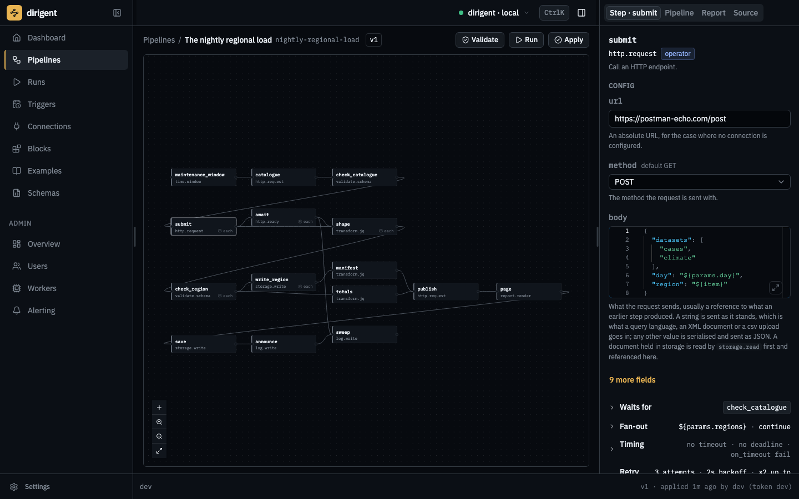
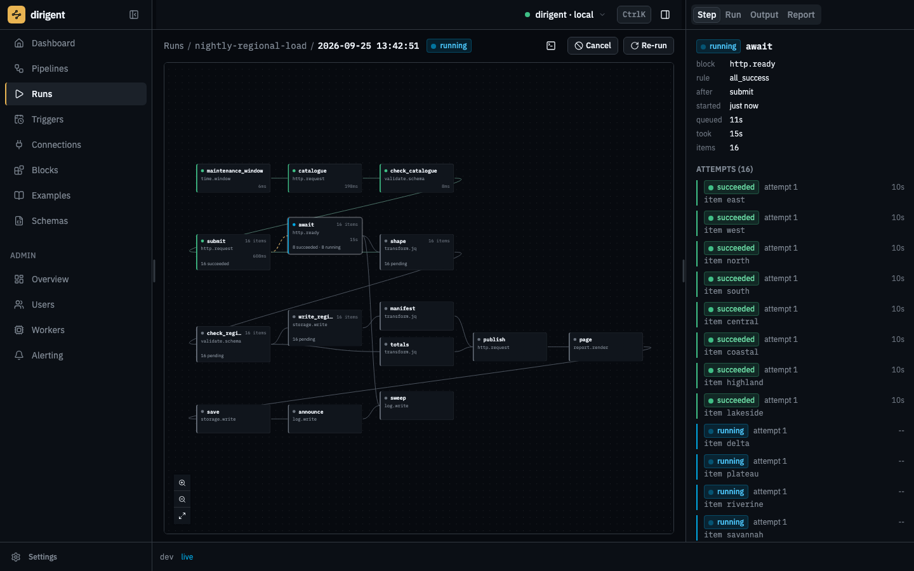
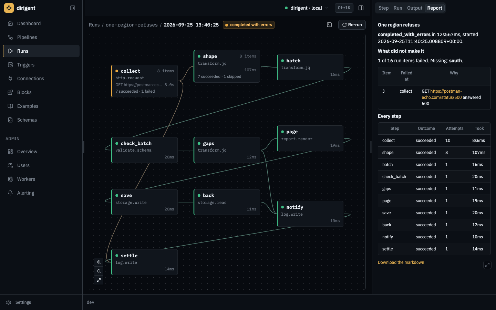
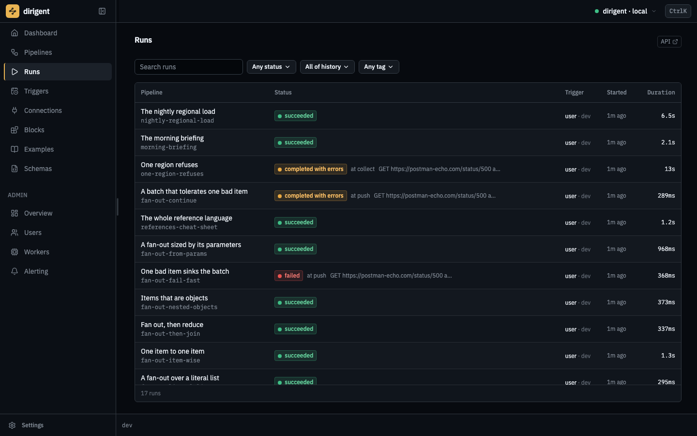
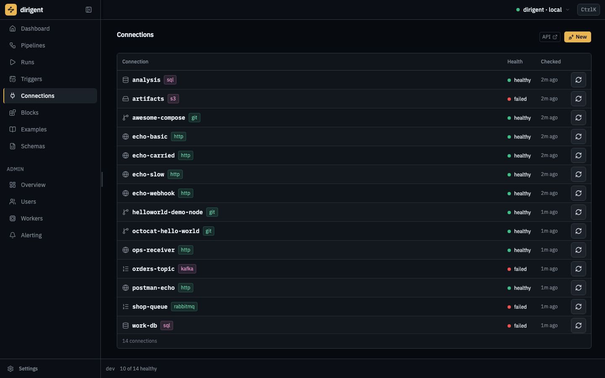
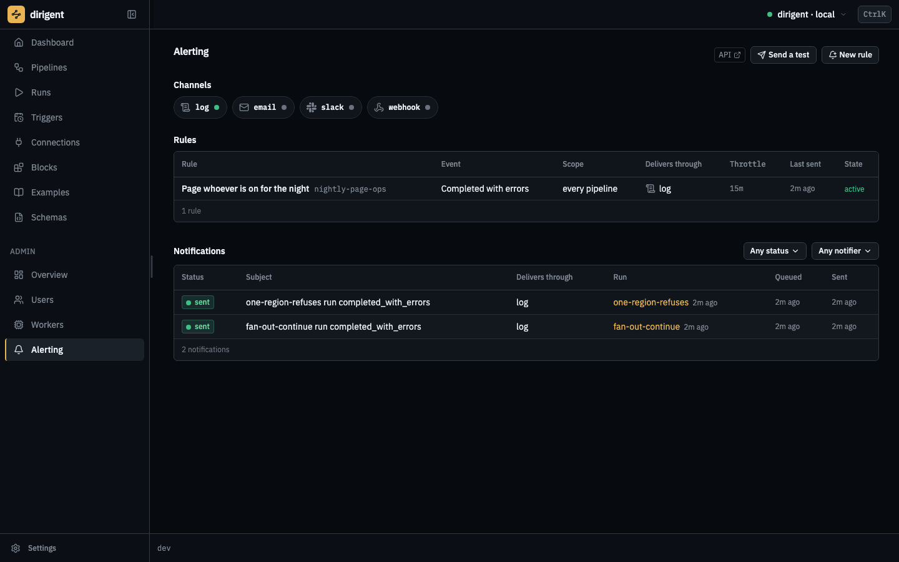
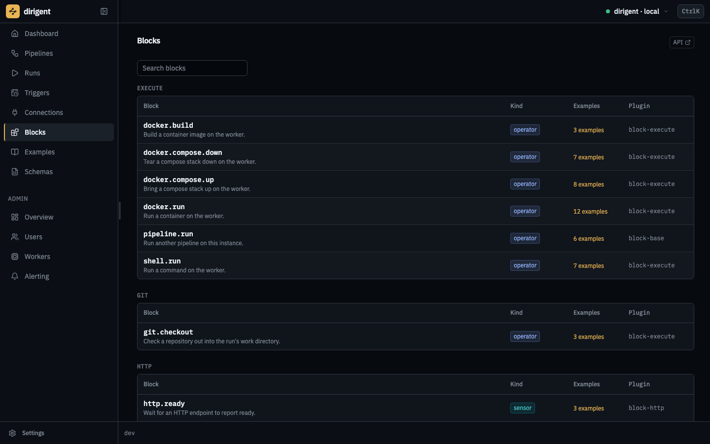

# Screens

What the web UI looks like with real work in it. Every picture below is of one instance, seeded
from [the example corpus](https://github.com/winterop-com/dirigent/tree/main/packages/dirigent-examples/src/dirigent_examples/shelves)
and put to work on the [`showcase/`](https://github.com/winterop-com/dirigent/tree/main/packages/dirigent-examples/src/dirigent_examples/shelves/showcase)
shelf: a fifteen-step nightly load over eight regions, the same night with one region's export
refusing, and a morning briefing over four feeds. Nothing here is a mockup, and nothing is a
happy path either. Click any picture to enlarge it.

The UI ships inside the server, so there is nothing to deploy to see this. `dg dev` is one
process with the API, a worker and the bundle in it, and `make dev-seeded` is that with the
corpus already applied.

## The dashboard

A day at a glance: how many runs there were, how they ended, and whether the things this
instance talks to are answering.

## Pipelines

A hundred and sixty documents, narrowed to the thirteen that fan out. Pipelines are found by
the tags they wear rather than by a folder somebody agreed on, and the last run is on the row.

## The editor

The graph is drawn from the document, and the panel is the step under the pointer: its block,
its config, its retry budget and what it fans out over.

## A run in flight

A fan-out while it is still happening. Eight regions submitted, eight readiness probes in the
air, and each one a row the engine is holding rather than a worker.

## A run that ended short

`completed_with_errors` is a third status and not a shade of failed: seven regions loaded and
one did not. The report is the run's own account of itself, rendered when it settled.

## Runs

Every run, newest first, with the status it settled in. A green history teaches nothing, so
this one is mixed on purpose.

## Connections

What this instance can reach, by code and kind. Secrets are encrypted at rest and redacted in
every answer; what is on screen is the health of the last check.

## Alerting

One chip per channel, and the rules underneath. The log channel needs no credential, which is
what makes alerting work on a fresh install.

## The block catalog

Every block the installed packages contribute, with the config schema that validates a step and
renders its form. Installing a pack extends this list without a frontend release.

## How these are made

`make docs-shots` drives a seeded instance in a real browser, runs the showcase documents to the
states each picture needs, and writes the nine files into `docs/images/screens/`. They are the
`dirigent` palette in dark mode at 1440x900, and the script refuses to take a picture of a screen
that scrolls sideways at that width. **They are re-shot on each release**, so what is on this
page is what the version you installed looks like.
